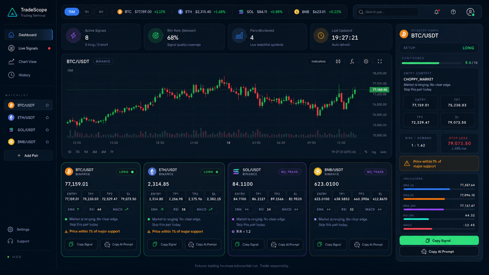

# TradeScope

**Personal crypto futures signal dashboard for research and manual analysis.**


> TradeScope is a personal analysis tool only. It is not a public signal service, not financial advice, and not live-trading ready. Crypto futures trading is high risk; validate every idea manually and use proper risk management.

## Preview / Screenshots




Replace these images with your actual app screenshots.

## Overview

TradeScope is a personal crypto futures dashboard designed to help monitor futures pairs, inspect technical indicators, and generate conservative setup labels: `LONG`, `SHORT`, or `WAIT`.

The application combines market data, technical indicator confluence, confidence scoring, copy-ready Telegram signal formatting, and manual AI second-opinion prompts. It is built for research, review, and paper-tracking workflows rather than automated trading or public signal distribution.

## Key Features

- 📈 Realtime crypto futures dashboard for monitored pairs
- ⭐ Watchlist support for frequently reviewed symbols
- 🧭 Signal cards with `LONG`, `SHORT`, or `WAIT` output
- 🧮 Confidence scoring based on technical confluence
- 🕯️ Mini candlestick charts for quick visual context
- 📊 EMA, RSI, MACD, volume, support, and resistance checks
- 📋 Copy-ready Telegram signal format
- 🤖 Copy AI prompt workflow for manual review in Claude, ChatGPT, or Gemini
- 🕘 Copy action history for review traceability
- 🏷️ Exchange source badge for Binance or Bybit data
- ⚠️ Error states for invalid, blocked, stale, or incomplete market data
- 🧪 Paper trading and proof utilities when configured

## Tech Stack

| Layer | Technology | Purpose |
| --- | --- | --- |
| Frontend | React | Component-based dashboard UI |
| Build Tool | Vite | Local development server and production build |
| Styling | TailwindCSS | Utility-first responsive styling |
| Charts | lightweight-charts | Candlestick and market visualization |
| Indicators | technicalindicators | EMA, RSI, MACD, and related calculations |
| Primary Market Data | Binance Public API WebSocket + REST | Public futures market data where available |
| Fallback Market Data | Bybit REST | Secondary public market data source when supported |
| Local Storage | localStorage | Browser-side preferences, watchlist, and copy history |
| Database / Paper Tracking | PostgreSQL | Optional durable storage for proof and paper-tracking utilities |
| Runtime | Node.js + npm | Development, scripts, and build workflow |

## Architecture

```text
┌──────────────┐
│   Frontend   │
│ React + Vite │
└──────┬───────┘
       │
       ▼
┌──────────────────────────┐
│    Market Data Layer     │
│ Binance Public API       │
│ Bybit REST fallback      │
└──────┬───────────────────┘
       │
       ▼
┌──────────────────────────┐
│    Indicator Engine      │
│ EMA / RSI / MACD / SR    │
└──────┬───────────────────┘
       │
       ▼
┌──────────────────────────┐
│      Signal Engine       │
│ LONG / SHORT / WAIT      │
│ Confidence confluence    │
└──────┬───────────────────┘
       │
       ▼
┌──────────────────────────┐
│        UI Output         │
│ Cards / Charts / Copy    │
└──────────────────────────┘
```

## Project Structure

```text
TradeScope/
├── src/
│   ├── components/          # Reusable dashboard UI components
│   ├── config/              # App and strategy configuration
│   ├── hooks/               # React hooks for data and UI behavior
│   ├── lib/                 # Market data, indicators, signal logic, utilities
│   ├── pages/               # Page-level React views
│   └── scripts/             # Backtest, proof, paper, and reporting scripts
├── api/                     # API/proxy endpoints where applicable
├── database/                # Database schema and setup assets
├── public/                  # Static public assets
├── docs/
│   └── screenshots/         # README screenshot placeholders
├── backtest-results/        # Generated strategy research outputs
├── paper-results/           # Generated paper-tracking outputs
├── data/
│   └── ohlcv-cache/         # Cached OHLCV data when available
├── dev-proxy.js             # Local market-data proxy used by npm run dev
├── package.json             # npm scripts and dependencies
└── vite.config.js           # Vite configuration
```

## Getting Started

```bash
git clone <repository-url>
cd TradeScope
npm install
npm run dev
```

Open the local app at:

```text
http://localhost:5173
```

`npm run dev` starts the Vite frontend and the local development proxy defined in `dev-proxy.js`.

## Available Scripts

Scripts are defined in `package.json`. Adjust or extend them based on your local workflow.

| Script | Purpose |
| --- | --- |
| `npm run dev` | Start Vite and the local development proxy |
| `npm run build` | Build the frontend for production |
| `npm run preview` | Preview the production build locally |
| `npm run backtest:batch` | Run batch backtest research scripts |
| `npm run proof:snapshot` | Write a proof snapshot when data/configuration is available |
| `npm run paper:report` | Generate paper-trading report output |
| `npm run paper:daily-check` | Run daily paper-tracking checks |
| `npm run paper:weekly-audit` | Generate weekly paper audit output |
| `npm run test:signal` | Run signal logic tests |

## Configuration

The base dashboard does not require paid API keys. Public market data is read from Binance and, where supported, Bybit fallback endpoints.

Environment variables are only needed when optional database, proxy, or durable paper-tracking features are enabled. Keep local secrets out of source control by using `.env` or `.env.local`.

```bash
DATABASE_URL=
MARKET_DATA_PROXY_URL=
```

Do not generate trading signals from stale, blocked, price-only, or incomplete market data. Error and safety states should remain enabled.

## How It Works

1. The user selects or watches a futures pair.
2. TradeScope requests market data such as klines, ticker data, and related market context.
3. The indicator engine calculates EMA, RSI, MACD, volume context, support, and resistance.
4. The signal engine evaluates trend, momentum, and key levels.
5. The UI displays `LONG`, `SHORT`, or `WAIT` with a confidence label.
6. The user may copy a Telegram-style signal or copy an AI prompt for manual second opinion.

### Signal Logic Summary

- **Trend filter:** EMA20, EMA50, and EMA200
- **Momentum:** RSI and MACD
- **Key levels:** support and resistance from recent candles
- **Confidence score:**
  - `3/3` = `HIGH`
  - `2/3` = `MEDIUM`
  - `0-1/3` = `LOW`

## Signal Output Example

```text
Pair: BTCUSDT
Type: WAIT
Leverage: Manual / user-defined
Confidence: MEDIUM
Entry Zone: Wait for valid confirmation near planned level
Targets: T1 / T2 / T3 based on current structure
Stop Loss: Invalidated if key level breaks
Basis: EMA trend, RSI momentum, MACD confirmation, volume context, support/resistance
Disclaimer: Personal research only. Not financial advice. Validate manually before taking any action.
```

## AI Prompt Workflow

TradeScope supports a manual AI review workflow without paid AI API integration:

1. The dashboard detects a potential setup or marks the pair as `WAIT`.
2. The user clicks **Copy AI Prompt**.
3. The prompt is pasted manually into Claude, ChatGPT, Gemini, or another assistant.
4. The AI response is used only as a second opinion, not as an execution command.

No automated AI trading execution is included.

## Research & Strategy Status

TradeScope is intentionally conservative about strategy readiness:

- **Active production strategy:** `v1.1-atr-risk`
- **Global verdict:** `NOT_READY`
- **Approved setups:** `0` unless updated by current research documents
- **Live execution:** `STUBBED` / inactive
- **Candidate strategies:** Backtest-only unless explicitly approved through research and paper-tracking review

Research outputs should be treated as evidence for analysis, not as proof of future profitability.

## Risk Disclaimer

Crypto futures trading carries substantial risk, including liquidation risk and rapid loss of capital. TradeScope does not guarantee profit, accuracy, or suitability for any trading decision.

Use the dashboard for personal research only. Always validate market data, review the setup manually, size positions responsibly, and follow your own risk management rules. This project is not financial advice.

## Roadmap

- [ ] Improve dashboard UX and responsive states
- [ ] Add real application screenshots to `docs/screenshots/`
- [ ] Improve strategy audit reports
- [ ] Add more robust market-data validation
- [ ] Add portfolio-level rare-edge audit utilities
- [ ] Improve paper trading reports
- [ ] Add broader test coverage

## Contributing

Contributions are welcome if they keep the project conservative, transparent, and research-focused.

Recommended contribution flow:

1. Fork the repository.
2. Create a focused feature or fix branch.
3. Keep changes small and well documented.
4. Run the relevant scripts or tests before opening a pull request.
5. Avoid claims about profitability, guaranteed returns, or live-trading readiness.

## License

To be decided.
